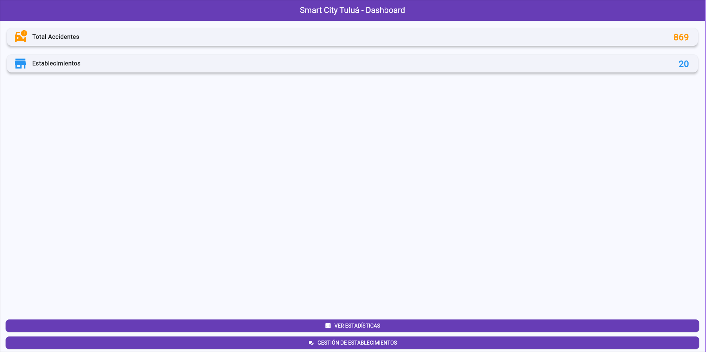
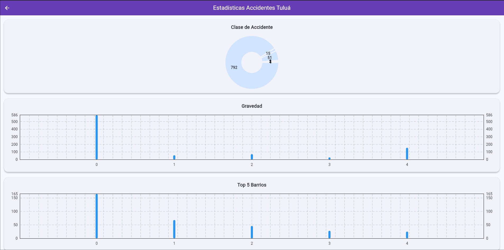
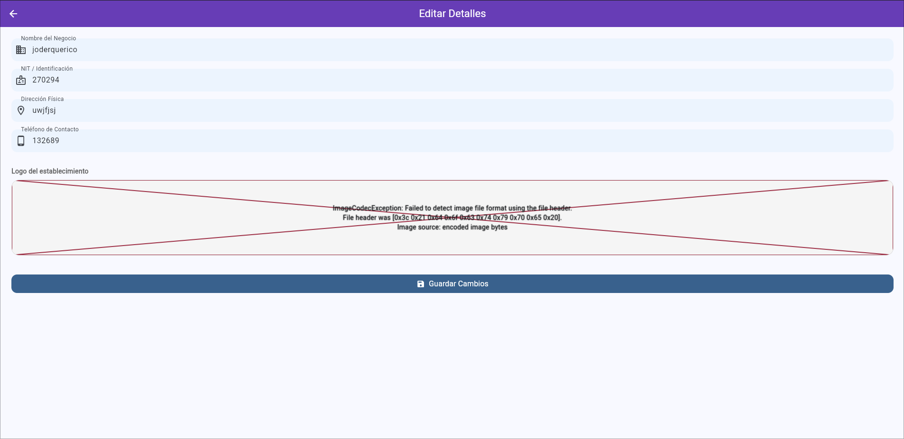
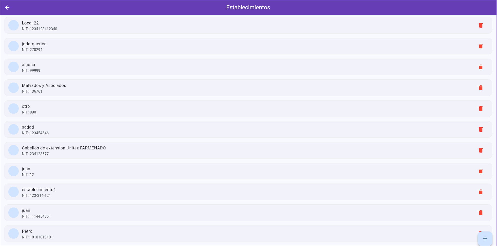

# Gestión de Establecimientos y Estadísticas de Accidentes - Tuluá

Este proyecto es una aplicación móvil desarrollada en **Flutter (Material 3)** que integra el consumo de APIs REST, procesamiento de datos pesado mediante **Isolates** y una interfaz de usuario moderna con carga asíncrona optimizada.

---

## 1. Arquitectura y Estructura del Proyecto

Se ha implementado una arquitectura limpia y modular dividida por capas de responsabilidad:

- **`models/`**: Definición de clases de datos (POJOs) y lógica de serialización (`fromJson`). Permite tipar fuertemente las respuestas del servidor.
- **`services/`**: Capa de red que utiliza el paquete `Dio` para manejar peticiones HTTP, interceptores y configuraciones de timeout.
- **`isolates/`**: Lógica de cómputo intensivo separada del hilo principal para garantizar la fluidez de la interfaz (60 FPS).
- **`views/`**: Componentes de interfaz de usuario organizados en pantallas independientes.
- **`routes/`**: Sistema de navegación declarativa utilizando `go_router`.

---

## 2. Descripción de las APIs

### A. API de Establecimientos (Gestión CRUD)

- **Fuente:** Sistema de gestión Visiontic.
- **Endpoint:** `https://parking.visiontic.com.co/api/establecimientos`
- **Campos Relevantes:**
  - `nombre`: Identificación comercial.
  - `nit`: Número de identificación tributaria.
  - `logo`: Almacenamiento de imagen en servidor remoto.
  - `direccion` y `telefono`: Datos de contacto del local.

### B. API de Accidentes (Análisis de Datos)

- **Fuente:** Datos Abiertos Alcaldía de Tuluá.
- **Campos Relevantes:**
  - `clase_accidente`: Categorización del siniestro.
  - `gravedad`: Impacto (Con heridos, solo daños, con muertos).
  - `barrio`: Ubicación para georreferenciación estadística.
  - `fecha`: Procesada para determinar tendencias temporales.

---

## 3. Concurrencia: Future vs Isolate

En el desarrollo de software de alto rendimiento, es crucial entender cuándo delegar tareas:

1.  **Future / async / await**: Utilizado para peticiones a la API. Como es una tarea de **I/O (Input/Output)**, el procesador simplemente espera la respuesta del servidor sin consumir ciclos de CPU significativos.
2.  **Isolate**: Utilizado para el **procesamiento estadístico**.
    - **Razón**: Analizar miles de registros de accidentes para agruparlos por barrio, día y gravedad es una tarea de **CPU Bound**.
    - **Elección**: Se eligió `Isolate` (mediante `compute` y `AccidenteIsolate.procesarDatos`) para evitar el "jank" o congelamiento de la UI, ejecutando el filtrado en un hilo de memoria separado.

---

## 4. Rutas y Navegación (`go_router`)

Se utiliza `go_router` para un manejo de rutas más robusto y legible:

- **Rutas**:
  - `/`: Dashboard principal.
  - `/accidentes`: Vista de analítica de datos.
  - `/establecimientos`: Módulo administrativo de locales.
  - `/formulario`: Pantalla dual que detecta si recibe un objeto `Establecimiento` para entrar en modo **Editar** o **Crear**.
- **Parámetros**: Se utiliza el objeto `extra` para pasar instancias completas de modelos entre pantallas sin perder el estado.

---

## 5. Capturas de Pantalla

|        Dashboard y Listado         |       Estadísticas (Isolates)        |
| :--------------------------------: | :----------------------------------: |
|    |  |
|   **Formulario (Crear/Editar)**    |     **Eliminación y Skeletons**      |
|  |      |

---

## 6. Ejemplos de Respuesta JSON

### API Establecimientos

```json
{
  "success": true,
  "data": [
    {
      "id": 43,
      "nombre": "UCEVA 3 XD",
      "nit": "963555",
      "logo": "6pbQemUT...png",
      "estado": "A"
    }
  ]
}
```
